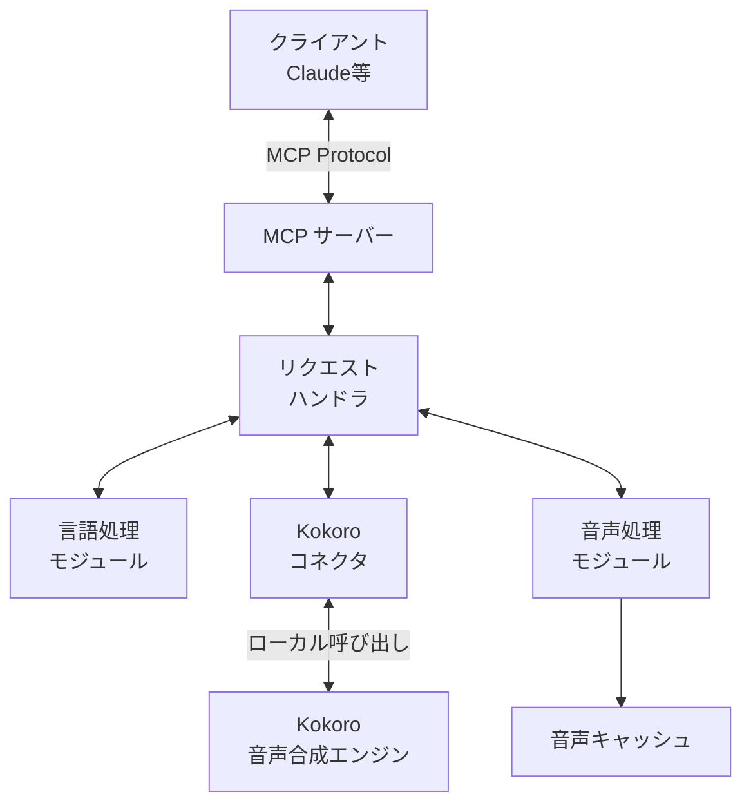
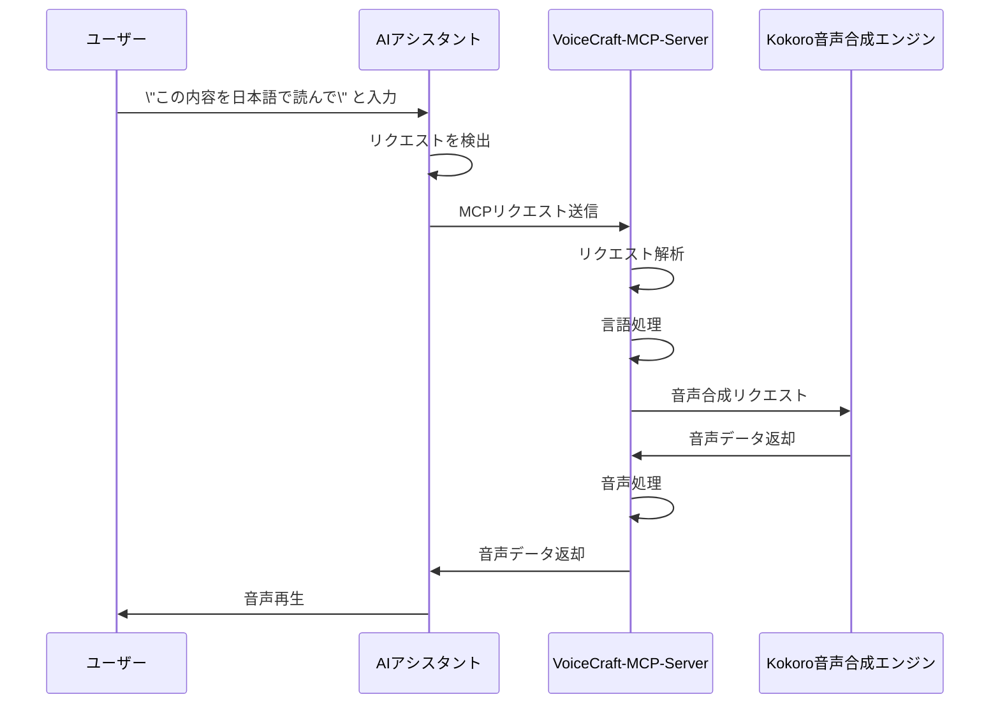
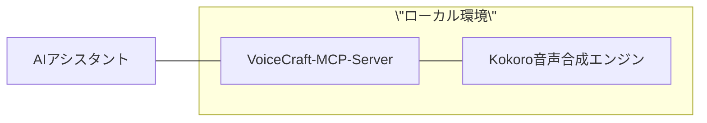

このドキュメントではVoiceCraft-MCP-Serverのシステムアーキテクチャについて詳細に説明します。

## システム概要

VoiceCraft-MCP-Serverは、AIアシスタント（Claude等）とKokoro音声合成エンジンを連携させるためのMCPサーバーです。このシステムにより、AIアシスタントのテキスト応答を自然な音声に変換し、よりリッチなユーザー体験を提供します。

## アーキテクチャ図



## 主要コンポーネント

### 1. MCPサーバー

MCPサーバーは、AIアシスタントからのリクエストを受け付け、適切なハンドラにディスパッチする役割を担います。

```python
# 疑似コード
class MCPServer:
    def __init__(self, host, port):
        self.host = host
        self.port = port
        self.handlers = {}
    
    def register_handler(self, command, handler_func):
        self.handlers[command] = handler_func
    
    def start(self):
        # サーバーソケットの初期化と受信ループ
        # リクエストの受信と処理
        pass
    
    def handle_request(self, request):
        command = request.get_command()
        if command in self.handlers:
            return self.handlers[command](request)
        else:
            return {\"error\": \"Unknown command\"}
```

MCPサーバーは、WebSocketベースの通信を行い、JSONフォーマットでリクエストとレスポンスを処理します。

### 2. リクエストハンドラ

各種リクエストを処理するハンドラ群です。主に「テキスト読み上げ」と「会話音声生成」を担当します。

```python
# 疑似コード
def handle_tts_request(request):
    # リクエストからパラメータを抽出
    text = request.get_parameter(\"text\")
    language = request.get_parameter(\"language\")
    options = request.get_parameter(\"options\", {})
    
    # パラメータの検証
    if not text:
        return {\"error\": \"Text is required\"}
    
    # 言語検出（未指定の場合）
    if not language:
        language = language_processor.detect(text)
    
    # テキスト前処理
    processed_text = language_processor.preprocess(text, language)
    
    # Kokoro音声合成エンジンを呼び出し
    result = kokoro_connector.generate_speech(processed_text, language, options)
    
    # 音声処理（必要に応じて）
    processed_audio = audio_processor.process(result.audio_data, options)
    
    # レスポンスを返却
    return {
        \"status\": \"success\",
        \"audio_data\": processed_audio,
        \"format\": \"mp3\",
        \"language\": language
    }
```

### 3. 言語処理モジュール

テキストの言語検出や前処理を行うモジュールです。

```python
# 疑似コード
class LanguageProcessor:
    def __init__(self):
        # 言語検出のための初期化処理
        pass
    
    def detect(self, text):
        # 日本語と英語の文字カウントなどで言語を判定
        japanese_chars = count_japanese_characters(text)
        english_chars = count_english_characters(text)
        
        if japanese_chars > english_chars:
            return \"japanese\"
        else:
            return \"english\"
    
    def preprocess(self, text, language):
        # 言語に応じたテキスト前処理
        if language == \"japanese\":
            # 日本語特有の前処理
            return process_japanese(text)
        elif language == \"english\":
            # 英語特有の前処理
            return process_english(text)
        else:
            # その他の言語、またはデフォルト処理
            return text
```

### 4. Kokoroコネクタ

ローカルにインストールされたKokoro音声合成エンジンと連携するモジュールです。

```python
# 疑似コード
class KokoroConnector:
    def __init__(self, kokoro_path):
        self.kokoro_path = kokoro_path
        # Kokoroエンジンの初期化
        self.initialize()
    
    def initialize(self):
        # Kokoroエンジンの初期化処理
        # モデルのロードなど
        pass
    
    def generate_speech(self, text, language, options=None):
        # デフォルトオプション
        default_options = {
            \"speed\": 1.0,
            \"pitch\": 0.0,
            \"voice_type\": \"default\"
        }
        
        # オプションのマージ
        if options:
            merged_options = {**default_options, **options}
        else:
            merged_options = default_options
        
        # Kokoro音声合成エンジンの呼び出し
        # ローカルプロセスとして実行、またはライブラリ呼び出し
        audio_data = self._call_kokoro_engine(text, language, merged_options)
        
        return {
            \"audio_data\": audio_data,
            \"format\": \"mp3\"
        }
    
    def _call_kokoro_engine(self, text, language, options):
        # 実際のKokoro音声合成エンジン呼び出し処理
        # コマンドライン実行またはAPI呼び出し
        pass
```

### 5. 音声処理モジュール

生成された音声データの処理やキャッシュを担当します。

```python
# 疑似コード
class AudioProcessor:
    def __init__(self, cache_dir=None):
        self.cache_dir = cache_dir
        if cache_dir:
            os.makedirs(cache_dir, exist_ok=True)
    
    def process(self, audio_data, options=None):
        # 音声データの処理
        # 音量の正規化、フォーマット変換など
        processed_audio = self._apply_audio_processing(audio_data, options)
        
        # キャッシュが有効な場合は保存
        if self.cache_dir:
            cache_key = self._generate_cache_key(audio_data, options)
            self._save_to_cache(processed_audio, cache_key)
        
        return processed_audio
    
    def _apply_audio_processing(self, audio_data, options):
        # 実際の音声処理ロジック
        pass
    
    def _generate_cache_key(self, audio_data, options):
        # キャッシュキーの生成
        pass
    
    def _save_to_cache(self, audio_data, cache_key):
        # キャッシュへの保存
        pass
    
    def get_from_cache(self, cache_key):
        # キャッシュからの取得
        if not self.cache_dir:
            return None
        
        cache_path = os.path.join(self.cache_dir, cache_key)
        if os.path.exists(cache_path):
            with open(cache_path, \"rb\") as f:
                return f.read()
        
        return None
```

## データフロー

1. ユーザーがClaudeなどのAIアシスタントに「この内容を日本語で読んで」などのリクエストを送信
2. AIアシスタントがMCPプロトコルを通じてVoiceCraft-MCP-Serverにリクエストを送信
3. MCPサーバーがリクエストを受信し、リクエストハンドラにディスパッチ
4. 言語処理モジュールでテキスト処理（言語検出、前処理など）
5. Kokoroコネクタが音声合成エンジンを呼び出し
6. 音声処理モジュールで必要に応じて音声データを処理
7. 生成された音声データをAIアシスタントに返送
8. AIアシスタントがユーザーに音声を再生

## MCPプロトコル通信フロー



## エラーハンドリング

システム全体で以下のエラーハンドリング戦略を採用します：

1. **検証エラー**: リクエストパラメータが不足または無効な場合
2. **言語サポートエラー**: サポートされていない言語が指定された場合
3. **Kokoroエンジンエラー**: 音声合成処理に失敗した場合
4. **システムエラー**: その他の予期しないエラー

各エラーは、MCPレスポンスとして適切なエラーコードとメッセージと共に返されます。

```python
# 疑似コード：エラーレスポンスの例
def create_error_response(code, message):
    return {
        \"status\": \"error\",
        \"error\": {
            \"code\": code,
            \"message\": message
        }
    }
```

## 拡張性設計

本システムは以下の拡張ポイントを考慮して設計されています：

1. **言語サポートの拡張**: 新しい言語を追加するためのプラグイン機構
2. **音声合成エンジンの切り替え**: Kokoro以外の音声合成エンジンをサポート
3. **カスタムプリプロセッサ**: 特定のテキストパターンに対する前処理ロジックを追加
4. **音声後処理フィルタ**: カスタム音声効果や処理を追加

これらの拡張ポイントは、プラグインアーキテクチャとインターフェース設計により実現されます。

## パフォーマンス考慮事項

1. **音声キャッシング**: 頻繁に使用されるフレーズの音声をキャッシュ
2. **並行リクエスト処理**: 同時に複数のリクエストを処理
3. **リソース管理**: Kokoro音声合成エンジンへの呼び出しを最適化
4. **メモリ使用量**: 大きな音声データの効率的な処理

## セキュリティ考慮事項

1. **入力検証**: すべてのユーザー入力を適切に検証
2. **リソース制限**: 過大なリクエストによるDoS攻撃の防止
3. **ローカル処理**: すべての音声処理をローカル環境で実行し、データの外部送信を回避

## デプロイメントアーキテクチャ

本システムは以下の方法でデプロイ可能です：

1. **スタンドアロンサーバー**: ローカルPC上で実行
2. **Dockerコンテナ**: コンテナ化された環境で実行
3. **サービス統合**: 既存のアプリケーションにライブラリとして統合



## 将来の拡張計画

1. **多言語サポート**: より多くの言語に対応
2. **感情表現**: 感情を込めた音声合成の実現
3. **リアルタイムストリーミング**: 長いテキストのストリーミング処理
4. **音声認識統合**: 双方向の音声対話を実現

## 技術的な依存関係

- **Python**: 3.8以上
- **WebSocket**: 通信プロトコル
- **JSON**: データ形式
- **Kokoro**: 音声合成エンジン
- **pydub/librosa**: 音声処理ライブラリ（候補）

本アーキテクチャは、モジュール性、拡張性、保守性を重視して設計されています。各コンポーネントは疎結合であり、必要に応じて個別に更新・拡張できます。
