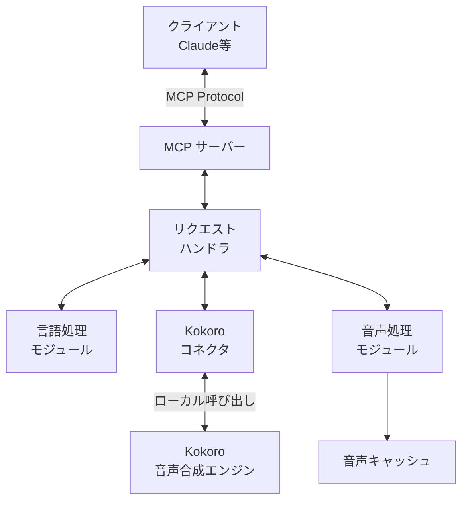
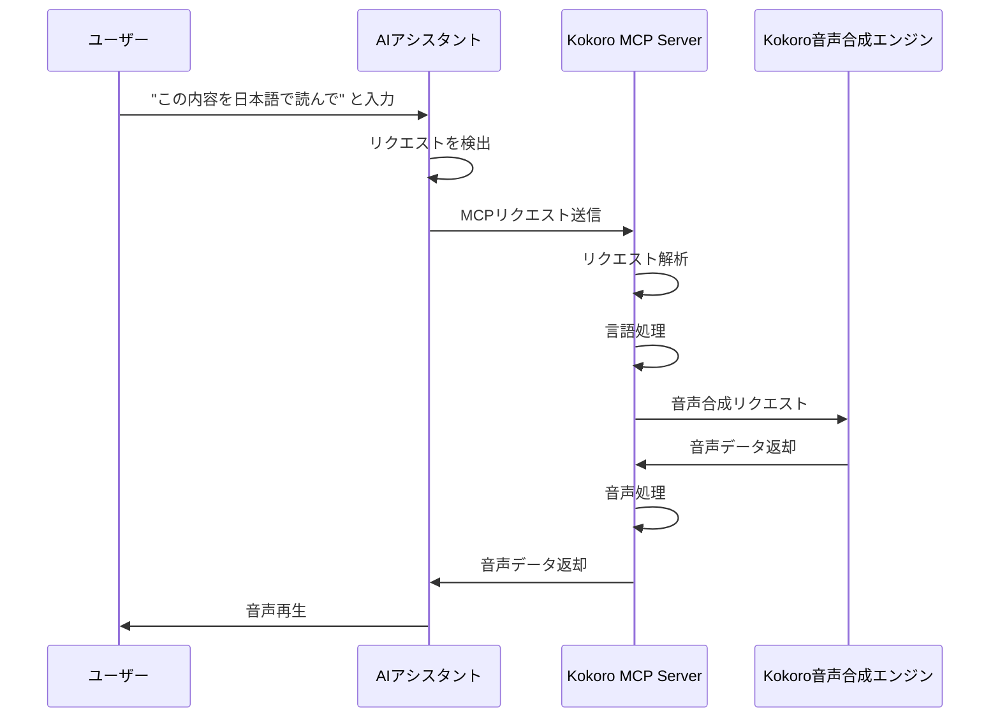
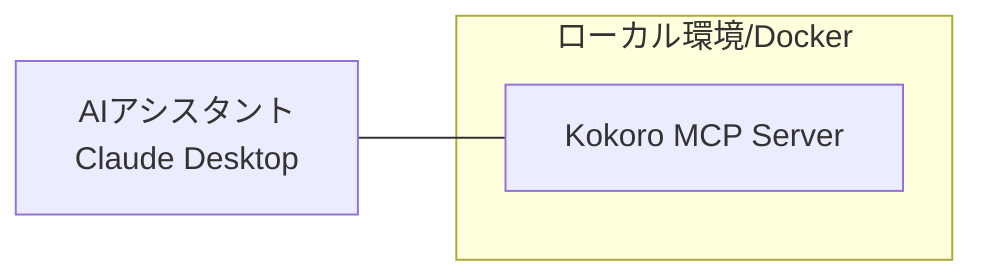
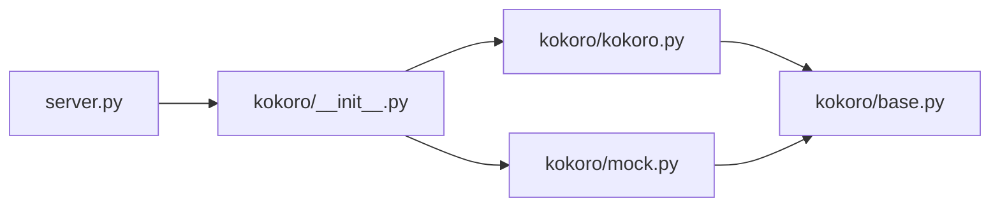

# Kokoro MCP Server アーキテクチャ

このドキュメントではKokoro MCP Serverのシステムアーキテクチャについて詳細に説明します。

## システム概要

Kokoro MCP Serverは、AIアシスタント（Claude等）とKokoro音声合成エンジンを連携させるためのMCPサーバーです。このシステムにより、AIアシスタントのテキスト応答を自然な音声に変換し、よりリッチなユーザー体験を提供します。

## アーキテクチャ図



## 主要コンポーネント

### 1. MCPサーバー

MCPサーバーは、AIアシスタントからのリクエストを受け付け、適切なハンドラにディスパッチする役割を担います。FastMCPフレームワークを使用してMCPプロトコルの実装を行っています。

```python
# 疑似コード
from mcp.server.fastmcp import FastMCP

# サーバーの準備
mcp = FastMCP("kokoro-mcp-server")

# ツールの登録
@mcp.tool()
def text_to_speech(text: str, voice: str = "jf_alpha", speed: float = 1.0):
    # 実装...
    
# リソースの登録
@mcp.resource("voices://available")
def get_available_voices():
    # 実装...
```

MCPサーバーは、WebSocketベースの通信を行い、JSONフォーマットでリクエストとレスポンスを処理します。また、標準入出力（STDIO）を使用したローカルプロセス間通信もサポートしています。

### 2. TTSサービス

音声合成処理の中核となるコンポーネントで、以下の2つの実装を提供しています：

1. **KokoroTTSService**: 実際の音声合成を行う実装
2. **MockKokoroTTSService**: テスト・開発用のモック実装

```python
# 疑似コード
class BaseTTSService:
    def generate(self, request: TTSRequest) -> tuple[bool, Optional[str]]:
        """音声を生成する"""
        raise NotImplementedError

class KokoroTTSService(BaseTTSService):
    def __init__(self):
        """初期化"""
        self.pipeline = self._create_pipeline()
        
    def _create_pipeline(self):
        """TTSパイプラインを作成"""
        # 実装...
    
    def generate(self, request: TTSRequest) -> tuple[bool, Optional[str]]:
        """音声を生成する"""
        # 実装...
```

TTSサービスはモデルをロードし、テキストを音声に変換する処理を担当します。生成された音声データはWAVファイルとして保存され、クライアントに返されます。

### 3. 言語処理モジュール

テキストの言語検出や前処理を行うモジュールです。MeCabとfugashiなどのライブラリを使用して日本語テキストを適切に処理します。

```python
# 疑似コード
def setup_mecab() -> bool:
    """MeCabのセットアップを行う"""
    # 実装...

def setup_fugashi() -> bool:
    """fugashiと関連する日本語辞書をセットアップする"""
    # 実装...
```

日本語の文章を適切に音声合成するために、テキストの分割や読み仮名の付与などの処理を行います。

### 4. 音声処理モジュール

生成された音声データの処理やキャッシュを担当します。音声の速度調整やリサンプリングなどを行います。

```python
# 疑似コード
def _adjust_speed(audio: Tensor, speed: float) -> Tensor:
    """音声の速度を調整する"""
    # 実装...
```

生成された音声は、サンプルレートを44100Hzに変換し、WAVファイルとして保存されます。

## データフロー

1. ユーザーがClaudeなどのAIアシスタントに「この内容を日本語で読んで」などのリクエストを送信
2. AIアシスタントがMCPプロトコルを通じてKokoro MCP Serverにリクエストを送信
3. MCPサーバーがリクエストを受信し、リクエストハンドラにディスパッチ
4. 言語処理モジュールでテキスト処理（言語検出、前処理など）
5. KokoroコネクタがKokoro音声合成エンジンを呼び出し
6. 音声処理モジュールで必要に応じて音声データを処理
7. 生成された音声データをAIアシスタントに返送
8. AIアシスタントがユーザーに音声を再生

## MCPプロトコル通信フロー



## エラーハンドリング

システム全体で以下のエラーハンドリング戦略を採用します：

1. **検証エラー**: リクエストパラメータが不足または無効な場合
2. **言語サポートエラー**: サポートされていない言語が指定された場合
3. **音声合成エンジンエラー**: 音声合成処理に失敗した場合
4. **システムエラー**: その他の予期しないエラー

各エラーは適切なメッセージと共にクライアントに返されます。また、ログシステムによって詳細なエラー情報が記録されます。

## 拡張性設計

本システムは以下の拡張ポイントを考慮して設計されています：

1. **音声合成エンジンの拡張**: `BaseTTSService`を継承した新しい音声合成エンジンの実装を追加可能
2. **言語サポートの拡張**: 新しい言語モデルやトークナイザーを追加可能
3. **音声処理フィルタの拡張**: 音声処理パイプラインに新しいフィルタを追加可能

これらの拡張ポイントは、モジュール間の疎結合設計により実現されています。

## パフォーマンス考慮事項

1. **モデルのキャッシング**: 音声合成モデルは初期化時にロードされ、再利用されます
2. **並行リクエスト処理**: 非同期処理によって複数のリクエストを効率的に処理します
3. **リソース管理**: PyTorchなどのGPUリソースを効率的に管理します

## セキュリティ考慮事項

1. **入力検証**: すべてのユーザー入力を適切に検証して不正なリクエストを防止します
2. **ローカル処理**: すべての処理をローカル環境で行い、データの外部送信を回避します
3. **リソース制限**: 過大なリクエストによるDoS攻撃を防止するための制限を設けています

## デプロイメントアーキテクチャ

本システムは以下の方法でデプロイ可能です：

1. **Dockerコンテナ**: `docker-compose.yml`によるコンテナ化されたデプロイメント
2. **スタンドアロン**: Pythonスクリプトとして直接実行
3. **Claude統合**: Claude Desktopとの統合による簡易デプロイメント



## 技術的な依存関係

- **Python**: 3.10以上
- **MCP**: MCP ProtocolのPython実装（mcp-python, FastMCP）
- **音声処理**: PyTorch, librosa, soundfile
- **日本語処理**: MeCab, fugashi, pyopenjtalk
- **ユーティリティ**: pydantic, loguru, click

## Kokoroエンジンの実装詳細

Kokoroエンジンは以下のコンポーネントで構成されています：

1. **モデルローダー**: PyTorchベースのVitsModelをロードします
2. **トークナイザー**: テキストをトークン化します
3. **音声合成パイプライン**: トークン化されたテキストから音声を生成します
4. **後処理**: 生成された音声データのリサンプリングや速度調整を行います

```python
# 疑似コード：音声合成パイプライン
def pipeline(text, voice="jf_alpha", speed=1.0):
    # テキストのトークン化
    inputs = tokenizer(text, return_tensors="pt")
    
    # 音声生成
    with torch.no_grad():
        output = model(**inputs)
        
    # 音声データの取得
    audio = output.audio[0]
    
    # 速度調整
    if speed != 1.0:
        audio = adjust_speed(audio, speed)
        
    return audio
```

この音声合成パイプラインは、高品質な日本語音声を生成するために最適化されています。

## 将来の拡張計画

1. **多言語サポート**: より多くの言語に対応
2. **感情表現**: 感情を込めた音声合成の実現
3. **リアルタイムストリーミング**: 長いテキストのストリーミング処理
4. **ユーザーインターフェース**: Webベースの管理インターフェース

これらの拡張は、現在のアーキテクチャを基盤として開発される予定です。

## モジュール依存関係



このモジュール構造により、コード再利用と保守性が向上します。

---

本アーキテクチャは、モジュール性、拡張性、保守性を重視して設計されています。各コンポーネントは疎結合であり、必要に応じて個別に更新・拡張できます。