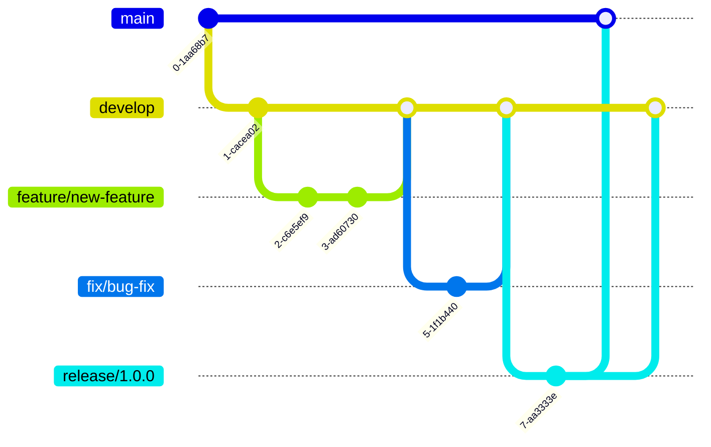

VoiceCraft-MCP-Serverプロジェクトへの貢献に関心をお寄せいただき、ありがとうございます。このガイドでは、プロジェクトに貢献するための方法について説明します。

## 行動規範

私たちのプロジェクトは、オープンで友好的なコミュニティを目指しています。参加者は相互に敬意を持って接することが期待されます。いかなる形のハラスメントや差別も許容されません。

## 貢献する方法

VoiceCraft-MCP-Serverには、さまざまな方法で貢献できます：

1. **バグの報告**: 問題を見つけたら、GitHub Issuesで報告してください
2. **機能リクエスト**: 新機能のアイデアがあれば、GitHub Issuesで提案してください
3. **コードの貢献**: プルリクエストを通じてコードを提供できます
4. **ドキュメントの改善**: ドキュメントの誤りや不足を修正・補完できます
5. **テストの追加**: 新しいテストケースや改善されたテストを提供できます
6. **レビュー**: 他の方のプルリクエストをレビューできます

## 開発プロセス

### 1. 問題の報告または機能の提案

バグ報告や機能リクエストを行う前に、既存のイシューを確認して、同様の問題が既に報告されていないか確認してください。

#### バグ報告書には以下の情報を含めてください：

- 問題の明確な説明
- 問題を再現する手順
- 期待される動作と実際の動作
- 環境情報（オペレーティングシステム、Python バージョン、依存パッケージなど）
- 可能であれば、スクリーンショットやエラーログ

#### 機能リクエストには以下の情報を含めてください：

- 機能の明確な説明
- なぜその機能が有用か
- 実装に関するアイデア（オプション）
- 関連する使用例

### 2. 開発環境のセットアップ

開発環境のセットアップ手順については、[DEVELOPMENT_SETUP.md](DEVELOPMENT_SETUP.md)を参照してください。

### 3. ブランチ戦略

以下のブランチ戦略に従ってください：

- `main`: 安定版リリースブランチ
- `develop`: 開発ブランチ（次のリリースの準備）
- 機能ブランチ: `feature/feature-name`
- バグ修正ブランチ: `fix/bug-name`
- リリースブランチ: `release/version-number`



### 4. プルリクエストの作成

1. プロジェクトをフォークする
2. 適切なブランチを作成する
3. 変更を実装する
4. テストを追加または更新する
5. 変更をコミットする
6. プルリクエストを作成する

```bash
# フォークしたリポジトリをクローン
git clone https://github.com/yourusername/VoiceCraft-MCP-Server.git
cd VoiceCraft-MCP-Server

# 上流リポジトリを追加
git remote add upstream https://github.com/originalowner/VoiceCraft-MCP-Server.git

# 最新の develop ブランチを取得
git fetch upstream
git checkout -b feature/my-feature upstream/develop

# 変更を実装、テスト...

# 変更をコミット
git add .
git commit -m \"Add feature: brief description\"

# フォークにプッシュ
git push origin feature/my-feature
```

その後、GitHubでプルリクエストを作成します。

## コーディング規約

### Python コーディングスタイル

- [PEP 8](https://pep8.org/) スタイルガイドに従ってください
- [Black](https://github.com/psf/black) フォーマッタを使用してください
- [isort](https://pycqa.github.io/isort/) でインポートを整理してください
- [flake8](https://flake8.pycqa.org/) でスタイルを検証してください
- [mypy](http://mypy-lang.org/) で静的型チェックを行ってください

```bash
# コードスタイルのチェックと修正
black src/ tests/
isort src/ tests/
flake8 src/ tests/
mypy src/
```

### コミットメッセージの規約

コミットメッセージは以下の形式に従ってください：

```
タイプ: 簡潔な説明（50文字以内）

より詳細な説明（必要な場合）。
72文字程度で改行してください。

- 箇条書きも可能です
- 影響を受ける部分や変更の理由を記載すると良いでしょう

refs #123
```

**タイプの種類**:
- `feat`: 新機能
- `fix`: バグ修正
- `docs`: ドキュメントのみの変更
- `style`: コードの意味に影響しない変更（空白、フォーマット、セミコロンの欠落など）
- `refactor`: バグ修正や機能追加ではないコード変更
- `perf`: パフォーマンスを向上させるコード変更
- `test`: 不足しているテストの追加や既存のテストの修正
- `chore`: ビルドプロセスやドキュメント生成などの変更

### ドキュメンテーション

- すべての新機能には、適切なドキュメントを追加してください
- すべての公開APIには、Pythonのdocstringを提供してください
- README.mdと他のドキュメントファイルを最新に保ってください

Pythonドキュメントには、[Google スタイルの docstring](https://sphinxcontrib-napoleon.readthedocs.io/en/latest/example_google.html) を使用してください：

```python
def generate_speech(text, language=None, options=None):
    \"\"\"テキストから音声を生成します。
    
    Args:
        text (str): 音声化するテキスト
        language (str, optional): 言語コード。指定がない場合は自動検出
        options (dict, optional): 音声オプション
        
    Returns:
        dict: 音声データを含むレスポンス
        
    Raises:
        ValueError: テキストが空の場合
    \"\"\"
    # 実装...
```

## テスト

すべての変更には、適切なテストを含めてください：

- 新機能には単体テストを追加する
- バグ修正には、バグを再現するテストを追加する
- できるだけ高いテストカバレッジを維持する

テストは `pytest` を使用して実行します：

```bash
# すべてのテストを実行
pytest

# カバレッジレポートを生成
pytest --cov=src

# 特定のテストを実行
pytest tests/test_mcp_server.py
```

## レビュープロセス

すべてのプルリクエストは、マージされる前に次のプロセスに従います：

1. 自動CI/CDチェック（テスト、コードスタイル、型チェックなど）
2. 少なくとも1人のメンテナによるコードレビュー
3. 必要に応じた修正と再レビュー

レビュアーは以下の点をチェックします：

- コードの品質と可読性
- テストの有無と品質
- ドキュメントの更新
- 変更の必要性と有用性
- 既存機能との互換性

## リリースプロセス

リリースプロセスは以下の手順で行われます：

1. `develop` ブランチから `release/X.Y.Z` ブランチを作成
2. リリース用の最終テストとバグ修正
3. バージョン番号とCHANGELOGの更新
4. `main` ブランチにマージ
5. Git タグの作成 (`vX.Y.Z`)
6. PyPI パッケージの公開（該当する場合）

## 特定の開発ガイドライン

### MCPプロトコル実装

MCPプロトコルを実装または拡張する際は：

1. プロトコル仕様を厳密に遵守する
2. 下位互換性を確保する
3. エラー処理を徹底する
4. 変更点を詳細にドキュメント化する

### Kokoro連携モジュール

Kokoro音声合成エンジンとの連携を開発する際は：

1. エンジンの抽象化レイヤーを維持する
2. 将来的に他の音声合成エンジンもサポートできるよう柔軟な設計にする
3. エラー状態を適切に処理する
4. パフォーマンスに注意を払う

### セキュリティのベストプラクティス

セキュリティに関して以下のガイドラインに従ってください：

1. すべてのユーザー入力を適切に検証する
2. センシティブな情報（APIキーなど）をハードコードしない
3. 適切な認証と認可を実装する
4. サードパーティの依存関係を定期的に更新する

## パッチの送信

### バグ修正

バグ修正のパッチには以下を含めてください：

1. バグを再現するテストケース
2. 根本原因の説明
3. 修正の実装
4. 関連ドキュメントの更新

### 機能追加

新機能のパッチには以下を含めてください：

1. 機能の詳細な説明と動機
2. 機能の設計と実装
3. 機能をカバーするテスト
4. ユーザー向けドキュメント
5. 必要に応じてAPIドキュメントの更新

## コミュニティ

質問や議論は、以下のチャンネルで行うことができます：

- GitHub Discussions
- プロジェクトのSlackチャンネル（該当する場合）
- メーリングリスト（該当する場合）

## ライセンス

VoiceCraft-MCP-ServerはMITライセンスの下で公開されています。プロジェクトに貢献することにより、あなたの貢献がこのライセンスの下で提供されることに同意したことになります。

---

私たちは、あなたの貢献を楽しみにしています！質問や不明点があれば、遠慮なくお問い合わせください。
